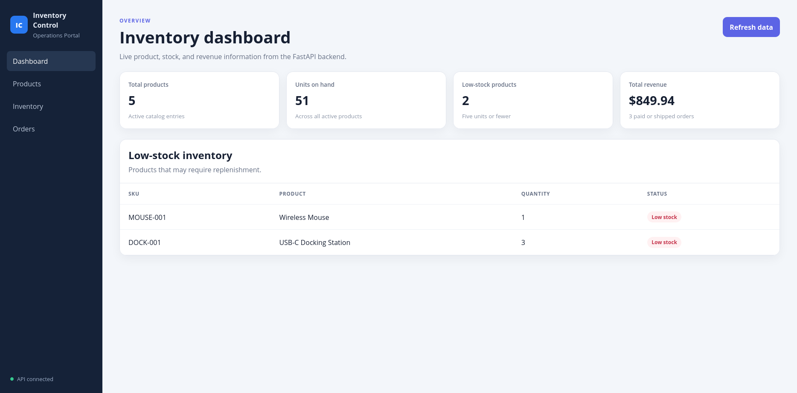
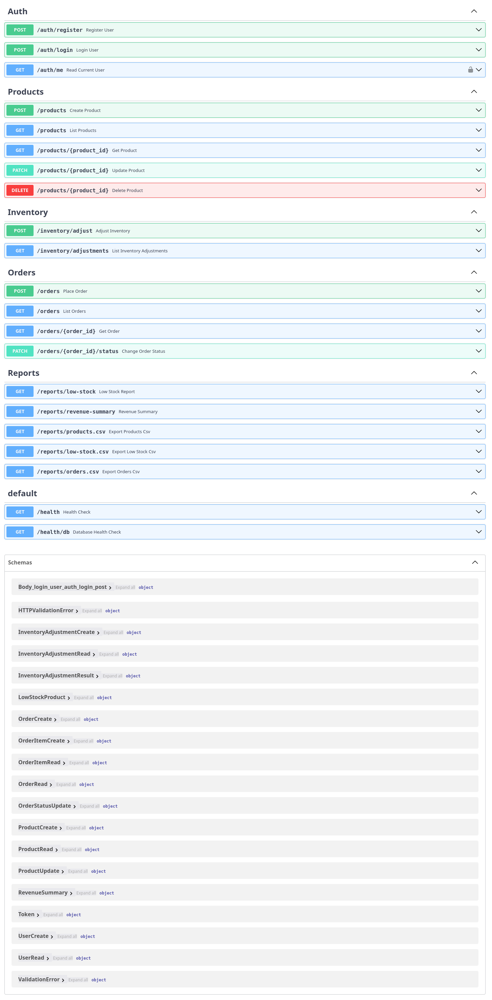
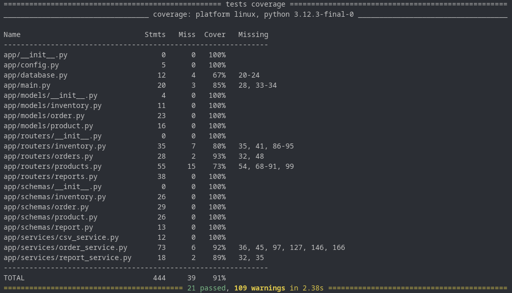

# Inventory Control

[](https://github.com/dmarti47-hub/inventory-api/actions/workflows/ci.yml)

[**Live Demo**](http://18.224.107.81/) · [**API Documentation**](http://18.224.107.81/api/docs)

> The live deployment contains synthetic demonstration data only. It currently uses HTTP, so do not submit sensitive information.

A full-stack inventory and order management application built with React, TypeScript, FastAPI, PostgreSQL, and Docker.

The application models a practical operations workflow: product management, auditable stock adjustments, transaction-safe order placement, order status transitions, low-stock monitoring, revenue reporting, and CSV exports.



## Project Highlights

- React and TypeScript operations dashboard
- Live product, inventory, order, and revenue data
- Product search by name or SKU
- Auditable inventory adjustment workflow
- Multi-item order creation with stock validation
- Order status workflow with automatic inventory restoration
- Transaction-safe backend operations using database row locking
- PostgreSQL persistence and Alembic migrations
- Nginx reverse proxy for the containerized frontend
- One-command full-stack Docker Compose setup
- Automated backend and frontend tests
- GitHub Actions CI for linting, testing, and production builds
- CSV exports for operational 
- Deployed on AWS EC2 with production Docker Compose
- Public Nginx frontend with reverse-proxied API access
- Private API and PostgreSQL networking
- Persistent database storage and container health checks

## Tech Stack

| Area | Technologies |
|---|---|
| Frontend | React, TypeScript, Vite |
| Routing | React Router |
| Server State | TanStack Query |
| Frontend Testing | Vitest, Testing Library, jsdom |
| Frontend Quality | ESLint, TypeScript compiler |
| API | FastAPI, Pydantic |
| Database | PostgreSQL |
| ORM | SQLAlchemy |
| Migrations | Alembic |
| Backend Testing | Pytest, Pytest-Cov |
| Backend Quality | Ruff |
| Web Server | Nginx |
| Containers | Docker, Docker Compose |
| Python Packages | uv |
| Continuous Integration | GitHub Actions |

## Features

### Dashboard

The dashboard retrieves live data from the FastAPI backend and displays:

- Total active products
- Units currently in stock
- Number of low-stock products
- Revenue from paid and shipped orders
- Low-stock inventory details
- Current API connection status

### Products

The Products page provides:

- Active product catalog
- SKU, price, quantity, and status information
- Search by product name or SKU
- Shared query caching with the dashboard and inventory pages

The API also supports product creation, updates, lookup, and soft deletion.

### Inventory

Inventory can be increased or decreased through a dedicated adjustment workflow.

Each adjustment records:

- Product
- Quantity change
- Reason
- Timestamp
- Previous quantity
- New quantity

Business rules prevent zero-value adjustments, inactive-product changes, and stock levels below zero.

### Orders

Users can:

- Create orders containing multiple products
- Add or remove order lines
- Filter orders by status
- Mark pending orders as paid
- Ship paid orders
- Cancel eligible orders

The backend validates the complete order before changing inventory. Duplicate product lines are combined, overselling is rejected, and canceling an unshipped order restores stock.

### Reports and Exports

The API provides:

- Low-stock reports
- Revenue summaries
- Product CSV exports
- Low-stock CSV exports
- Order CSV exports
- Order export filtering by status

Revenue totals include only paid and shipped orders.

## Order Status Workflow

| Current status | Allowed next status |
|---|---|
| `pending` | `paid`, `canceled` |
| `paid` | `shipped`, `canceled` |
| `shipped` | Final status |
| `canceled` | Final status |

## Quick Start with Docker

### Requirements

- Docker
- Docker Compose

Clone the repository:

```bash
git clone https://github.com/dmarti47-hub/inventory-api.git
cd inventory-api
```

Build and start the complete application:

```bash
docker compose up --build -d
```

Load the demonstration data:

```bash
docker compose exec api uv run python -m scripts.seed_demo_data
```

Open the application:

| Service | URL |
|---|---|
| React frontend | http://localhost:5173 |
| FastAPI documentation | http://localhost:8001/docs |
| FastAPI health check | http://localhost:8001/health |

Check container health:

```bash
docker compose ps
```

Stop the application:

```bash
docker compose down
```

The PostgreSQL application data is stored in a named Docker volume and remains available after the containers stop.

## Local Development

### Requirements

- Python 3.12
- uv
- Node.js 24
- npm
- Docker Compose

### Backend setup

Create the local environment file:

```bash
cp .env.example .env
```

Start the application and test databases:

```bash
docker compose up -d db test_db
```

Install Python dependencies:

```bash
uv sync --all-groups
```

Run migrations:

```bash
uv run alembic upgrade head
```

Load demo data:

```bash
uv run python -m scripts.seed_demo_data
```

Start the API:

```bash
uv run uvicorn app.main:app --reload --port 8001
```

### Frontend setup

In a second terminal:

```bash
cd frontend
cp .env.example .env.local
npm ci
npm run dev
```

Open:

```text
http://localhost:5173
```

The local frontend communicates with:

```text
http://127.0.0.1:8001
```

## API Overview

### Products

```text
POST   /products
GET    /products
GET    /products/{product_id}
PATCH  /products/{product_id}
DELETE /products/{product_id}
```

### Inventory

```text
POST /inventory/adjust
GET  /inventory/adjustments
```

### Orders

```text
POST  /orders
GET   /orders
GET   /orders/{order_id}
PATCH /orders/{order_id}/status
```

### Reports

```text
GET /reports/low-stock
GET /reports/revenue-summary
GET /reports/products.csv
GET /reports/low-stock.csv
GET /reports/orders.csv
```

## Database Design

The primary tables are:

- `products`
- `inventory_adjustments`
- `orders`
- `order_items`

Order items preserve the product price at the time of purchase so historical totals do not change when catalog prices are updated.

Database transactions and row-level locking protect inventory during order placement and stock adjustments.

## Testing

### Backend

Start the test database:

```bash
docker compose up -d test_db
```

Run linting:

```bash
uv run ruff check .
```

Run the test suite with coverage:

```bash
uv run pytest --cov=app --cov-report=term-missing
```

Current backend result:

```text
21 passed
91% coverage
```

### Frontend

```bash
cd frontend
npm ci
npm test
npm run lint
npm run build
```

The frontend test suite verifies successful API responses, inventory adjustment requests, and backend error handling.

## Continuous Integration

GitHub Actions runs separate backend and frontend jobs for every pull request.

The backend job:

- Starts PostgreSQL
- Installs Python dependencies
- Runs Ruff
- Runs Pytest with coverage

The frontend job:

- Installs dependencies with `npm ci`
- Runs Vitest
- Runs ESLint
- Performs a TypeScript and Vite production build

## AWS EC2 Deployment

**Live application:** http://18.224.107.81/

The application is deployed to an Ubuntu AWS EC2 instance as a three-container production stack:

- Nginx serves the compiled React application on port 80
- Nginx proxies `/api` requests to FastAPI over a private Docker network
- FastAPI connects to PostgreSQL over a separate private data network
- API and PostgreSQL ports are not published to the EC2 host
- PostgreSQL data persists in a named Docker volume
- Health checks and restart policies provide basic service recovery
- SSH access is restricted by the EC2 security group

The deployment uses environment-based credentials stored outside Git, automated Alembic migrations, a 2 GiB swap file for the small EC2 instance, and deployment scripts checked into the repository.

See [deploy/ec2/README.md](deploy/ec2/README.md) for configuration, deployment, operations, backup, and future HTTPS guidance.

> The current EC2 public IP may change if the instance is stopped and restarted because an Elastic IP has not been assigned.

See [deploy/ec2/README.md](deploy/ec2/README.md) for the EC2 configuration, security-group rules, secret creation, deployment, operations, backup, and HTTPS guidance.

## Project Structure

```text
inventory-api/
├── app/                    FastAPI application
│   ├── models/             SQLAlchemy models
│   ├── routers/            API route handlers
│   ├── schemas/            Pydantic request/response models
│   └── services/           Business logic and reporting
├── frontend/               React and TypeScript application
│   └── src/
│       ├── api/            API client and tests
│       └── pages/          Dashboard, products, inventory, and orders
├── alembic/                Database migrations
├── tests/                  Backend test suite
├── scripts/                Demo data utilities
├── docs/screenshots/       Portfolio screenshots
├── .github/workflows/      Continuous integration
├── docker-compose.yml      Full-stack container orchestration
└── Dockerfile              FastAPI container image
```

## Additional Screenshots

### Swagger API Documentation



### Test Coverage



## What This Project Demonstrates

This project demonstrates full-stack development across a typed React interface, REST API design, relational database modeling, transactional business logic, automated testing, containerization, reverse proxy configuration, and continuous integration.

It goes beyond basic CRUD by addressing realistic operational concerns such as concurrent stock updates, audit history, order state rules, overselling prevention, data exports, service health checks, and reproducible deployment.

## License

This project is licensed under the [MIT License](LICENSE).
